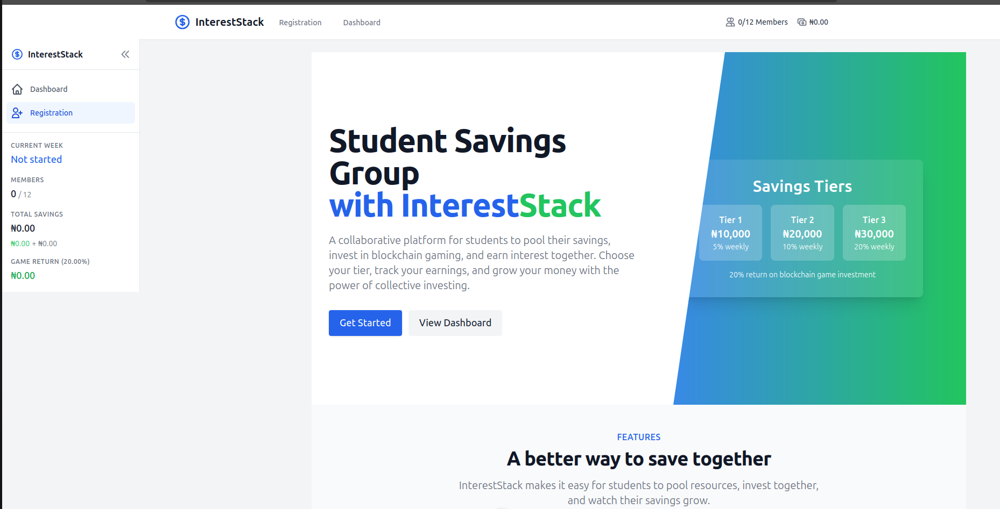
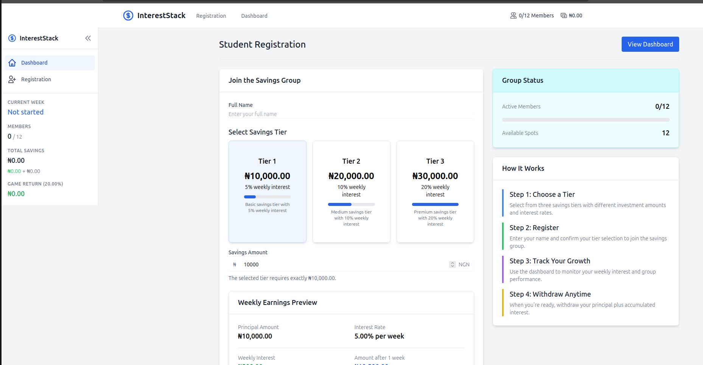
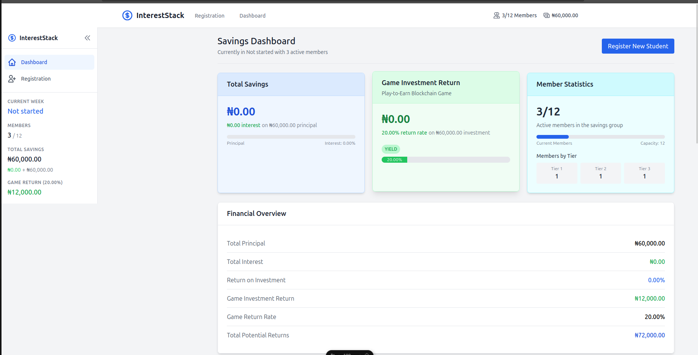
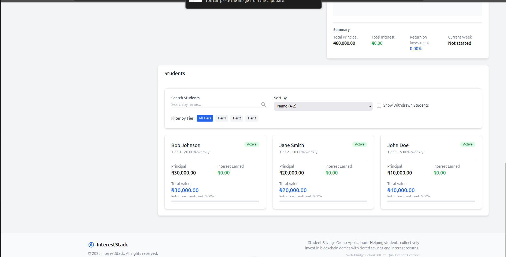
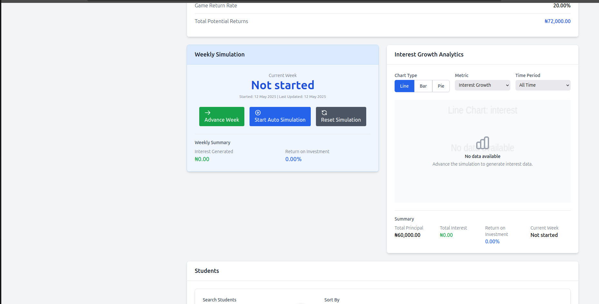

# InterestStack - Student Savings Group Application

InterestStack is a web application designed for students to form a savings group, where they can collectively invest their savings in a Play-to-Earn blockchain game that yields returns. The application features a tiered savings system with different interest rates, allowing students to track their contributions, accumulated interest, and manage withdrawals.







## 🚀 Features

- **Three-tier savings system**:
  - **Tier 1**: ₦10,000 with 5% weekly interest
  - **Tier 2**: ₦20,000 with 10% weekly interest
  - **Tier 3**: ₦30,000 with 20% weekly interest

- **Student Registration**: Register students with their name and selected savings tier, displaying their weekly interest and total withdrawal amount.

- **Savings Dashboard**: View total amount saved by all members with detailed breakdowns of each member's contribution and accumulated interest.

- **Tier Validation**: Ensures students select the correct amount for their chosen tier.

- **Weekly Simulation**: Simulate weekly progress with interest accumulation.

- **Withdrawal Management**: Process student withdrawals, updating the group totals and freeing up spots for new members.

- **Interactive Charts**: Visualize savings growth and interest accumulation over time.

## 💻 Technologies Used

- **Frontend Framework**: Javascript, Vue.js 3 with Nuxt 3
- **Type Safety**: TypeScript
- **State Management**: Pinia
- **Styling**: TailwindCSS
- **Build Tool**: Vite
- **Deployment**: Netlify

## 🛠️ Installation and Setup

### Prerequisites

- Node.js (v16 or later)
- npm or yarn

### Installation Steps

1. Clone the repository:
   ```bash
   git clone https://github.com/udofia2/intereststack.git
   cd intereststack
   ```

2. Install dependencies:
   ```bash
   npm install
   # or
   yarn install
   ```

3. Run the development server:
   ```bash
   npm run dev
   # or
   yarn dev
   ```

4. Build for production:
   ```bash
   npm run build
   # or
   yarn build
   ```

5. Preview the production build:
   ```bash
   npm run preview
   # or
   yarn preview
   ```


## 🔄 Git Workflow

This project follows a standard Git workflow:

1. `master` branch is the stable branch
2. `develop` branch is used for development
3. Feature branches are created for each feature:
   - `feature/student-registration`
   - `feature/savings-dashboard`
   - `feature/tier-validation`
   - `feature/withdrawal-management`
4. Pull requests from feature branches to develop
5. Pull requests from develop to master for releases

## 📱 Usage Guide

### Student Registration

1. Navigate to the Registration page
2. Enter the student's name
3. Select a savings tier (Tier 1, 2, or 3)
4. The correct amount for the selected tier will be automatically filled
5. View the projected weekly interest and withdrawal amount
6. Click "Register" to add the student to the savings group

### Dashboard Navigation

The dashboard provides several key features:

1. **Overview Metrics**: Total savings, interest generated, and member count
2. **Weekly Simulation**: Advance the simulation week by week to see interest accumulation
3. **Student List**: View all active and withdrawn members with detailed financial information
4. **Interest Chart**: Visualize the growth of savings and interest over time

### Withdrawal Process

1. Navigate to the Dashboard page
2. Find the student in the Student List
3. Click the "Withdraw Funds" button
4. Confirm the withdrawal in the modal
5. The student will be marked as withdrawn and their spot will be available for a new member


## 🤝 Contributing

Contributions are welcome! Please follow these steps:

1. Fork the repository
2. Create a feature branch: `git checkout -b feature/awesome-feature`
3. Commit your changes: `git commit -m 'Add awesome feature'`
4. Push to the branch: `git push origin feature/awesome-feature`
5. Open a pull request